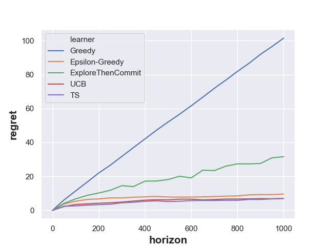
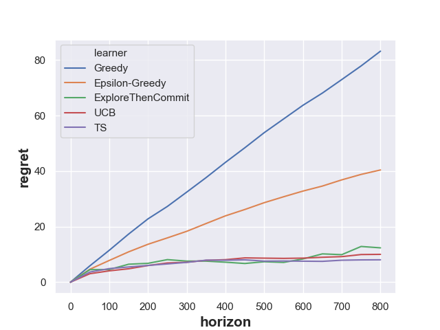
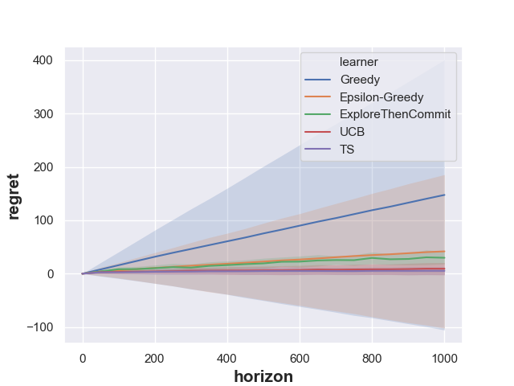
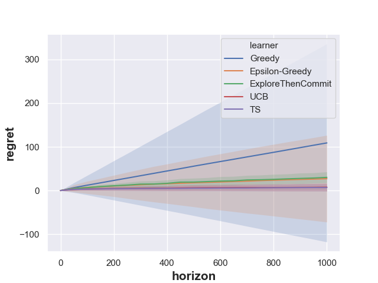

# Bandit Algorithms

The project conducts experiments in **multi-armed bandits** and **contextual bandits** to compare properties of different
learning policies. Currently, only the following policies and bandits are available. More types of bandits and policies
will be added later. Also, notice that this project only serves as an illustration for practice use. Users may need to
adapt some details for real-world scenarios.

Available Policies:
* Greedy Algorithm
* Epsilon Greedy Algorithm
* Explore-Then-Commit Algorithm
* Upper Bound Confidence (UCB) Algorithm
* Linear Upper Bound Confidence (UCB) Algorithm
* Thompson Sampling Algorithm

Available Bandits:
* Bernoulli-armed bandit
* linear contextual bandit with Gaussian arms

## Getting Started

Follow the instructions below to run simple examples and get the corresponding results.

### To Learn Multi-Armed Bandits
Enter the location of your python file, run the following command, then you will get a `data.out` storing the results of
empirical regrets and a `figure.png` showing the regret behavior of all five policies in one figure.
```
python learn_ber_bandit.py
```


### To Learn Contextual Bandits

Similarly, we call the mail file of contextual bandits learning by running the following command.
```
python learn_contextual_bandit.py
```


## Tuning Your Parameters

Follow the instructions below to set customized parameters to observe different behaviors of given algorithms. Notice that
those marked with ($) can only be used in contextual bandits learning.

### Flags

All available parameters are shown below. In particular, parameters of the general setting include:
* `--out`: String expected. The output file to store empirical regrets (file extension is needed). Default value is `data.out`.
* `--fig`: String expected. The file name of your output figure (.png is the default).Default value is `figure.png`.
* `--novar`: Boolean expected. If `True`, shows the naive figure, otherwise shows the figure with standard deviation region.
Default value is `False`.
* `--rm`: Boolean expected. If `True`, remove the output files you have generated previously. This is vital when you conduct
multiple experiments because the program will write data into the file line by line. Default value is `False`.
* `--minimax`: Boolean expected. If `True`, compute the minimax regret (currently only s sparse probabilities vector is
adopted for computation), Default value is `False`.
* `--prob`: Float expected. The real probability of your first Bernoulli arm to get a reward (remember that this is an
illustrative project therefore real distributions are needed). Default value is `0.2`.
* `--T`: Integer expected. Define the time horizon of the learning process. Default value is `1000`.
*  `--trials`: Integer expected. Define the number of trials for each algorithm to learn in order to get the average regret
Default value is `100`.
* `--freq`: Integer expected. Define the breakpoints for plotting use. Default value is `50`.
* ($) `--armnum`: Integer expected. Define the total number of arms. Default value is `10`.
* ($) `--inputnum`: number of inputs used in computing minimax regret. Default value is `10`.

Besides, hyper-parameters of different algorithms include:
* `--eps`: Float expected. Parameter epsilon for epsilon greedy algorithm. Default value is `1`.
* `--C`: Float expected. Parameter C for explore-then-commit algorithm. Default value is `1`.
* `--alpha`: Float expected. Parameter alpha for UCB algorithm. Default value is `0.5`.
* ($) `--alpha_LinUCB`: Float expected. Parameter alpha for linear UCB algorithm. Default value is `0.1`.

## Detailed Example
### Example 1
Since there is data.out file you generated before, you need to clean it by setting `--rm=True`. Now you can change some
hyper-parameters to see how regret curves change.

```
python main.py --novar=True --rm=True --T=800 --prob=0.35 --eps=1 --C=0.5
```

### Example 2
You can also set `--novar=False` and use different number of trials to see how region of standard deviations change

```
python main.py --novar=False --rm=True --trials=50

python main.py --novar=False --rm=True --trials=500
```



## Involved Modules
If you want to learn the real-world data by adapting some modules in this project. Follow the structure below:
+ `bandit.py`: A module including all man-made bandits. It's of no use in real-world scenarios.
+ `learner.py`: A module including all classes of learning algorithm.
+ `utils.py`: A module including some useful simulators and recorders (e.g., empirical arms recorder).
+ `learn_ber_bandit.py`: The main file to learn multi-arm bandit problems.
+ `learn_contextual_bandit.py`: The main file to learn contextual bandit problems.

## Authors
**Zhaoxuan Hins Hu** - University of Illinois at Urbana Champaign - zh22@illinois.edu
+ Contribute to the version 1.0 in 05/2020

## Reference and Acknowledgement
All the work are based on the course materials of Machine Learning for OR (2020 Spring, IE498) taught by Prof. Zhou Yuan
