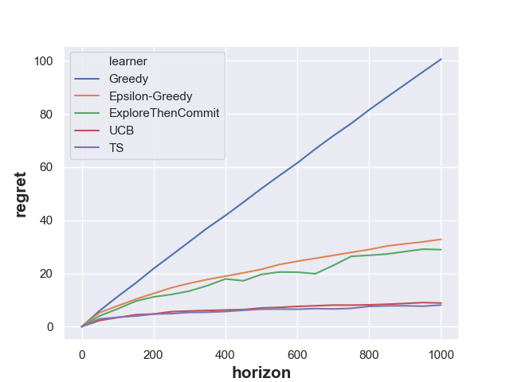
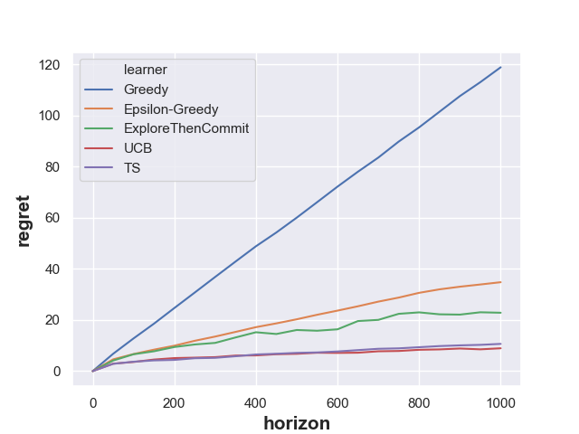
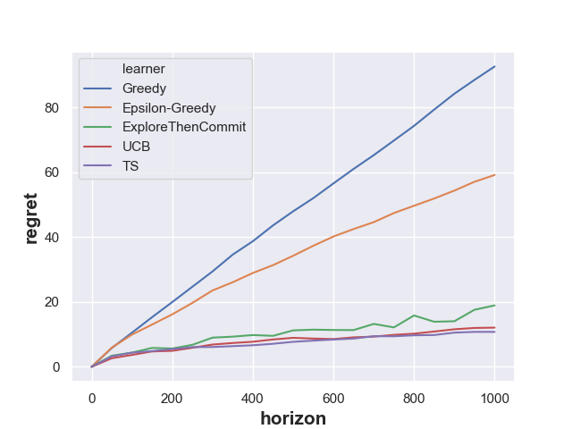
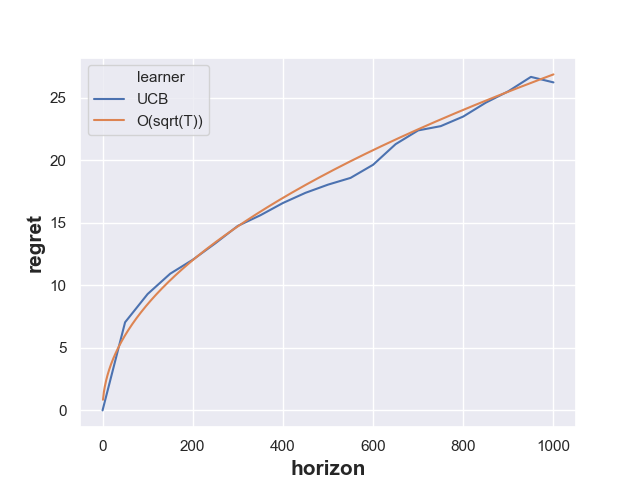
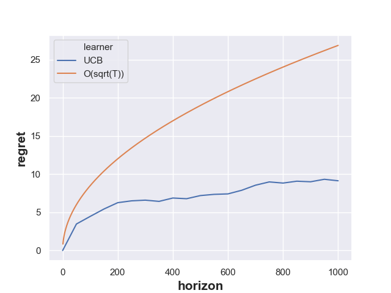

# Report of HW6

This is a short report of the HW6, which mainly discusses behaviors and performances of Bernoulli-armed bandit algorithms.
For all other details information please see the [README.md](README.md)

## Plots of Regret
Follow the recommendations of hyper-parameters in the handout, we have generate regret of all policies as well as minimax
regret shown in Figure 1 to Figure 6

Figure 1: True Mean = (0.2, 0.8)

Figure 2: True Mean = (0.25, 0.75)

Figure 3: True Mean = (0.3, 0.7)

Figure 4: True Mean = (0.35, 0.65)

Figure 5: True Mean = (0.4, 0.6)

Figure 6: Minimax Regret

\
Based on the figure above, we have the following observations:
+ Both *Greedy Algorithm* and *Epsilon Greedy Algorithm* introduce linear regrets but the latter performs better asymptotically
with a smaller slope. Their slope difference depends on the real distributions of Bernoulli arms, or more precise
on their difference `delta`. Also, the hyperparameter `eps` of the *Epsilon Greedy Algorithm* is another influencing factor.

+ The *Explore-Then-Commit Algorithm* has the moderate performance out of all given algorithms. It's regret curve lies between
that of the *Epsilon Greedy Algorithm* and *UCB Algorithm*, which corresponds to the theoretical analysis where its regret is bounded
by `O(T^(2/3))`. In practice, this algorithm is not so user friendly because the variation of cases make the hyperparameter
`C` very hard to tune.

+ The *UCB Algorithm* and *Thompson Sampling Algorithm* have very similar performance. When the difference of real distributions
`delta` is known, which one is better depends on `delta` itself. When the `delta` is unknown and we consider the worst adversarial
case, the *UCB Algorithm* out-perform a little bit. Nevertheless, both should have `O(sqrt(T))` minimax regret bounds, which
will be verified by more careful plots in next section.

## Analysis of UCB Algorithm
The UCB algorithm is further analyzed by comparisons of plots to check whether they satisfy their theoretical regret bounds. In particular, there
are two types of bounds involved here
+ The regret bound if the `delta` is known
+ The regret bound if the `delta` is unknown

### Unknown Delta
First, we compare the regret curve of the minimax UCB with the scale-transformed `O(sqrt(T))` curve, which is shown in figure 9 below.
We can observe that they have the same asymptotic behavior, meaning that the theoretical result we derived in the class is
correct. Notice that scale-transformation refers that we scale the `O(sqrt(T))` curve flexibly to get rid of the effect of the constant
term. In this case, we shrink the curve by a factor of 0.75

 
Figure 9: Comparison of Minimax Regret Bound

### Known Delta
Second, we compare the regret bound of the UCB with true distribution = `(0.35, 0.65)` to illustrate bounds of pure average regret.
From the figure 10 below, we observe that no matter how we scale the constant factor, the bound cannot be the `O(sqrt(T))`.
Instead, it has a lower order increasing rate. The reason comes from the fact that naive regret bounds of the *UCB Algorithm*
in one particular realization don't follow `O(sqrt(T))`, but have a better performance following a case-dependent bound
`O((lnT)/delta)`.

Figure 10: Comparison of Naive Regret Bound

## Conclusion
Overall, all policies have their advantages and disadvantages, whereby we need to design them reasonably according to the
real world problem. Theoretical bounds are beautiful, but constants really matter in reality.
