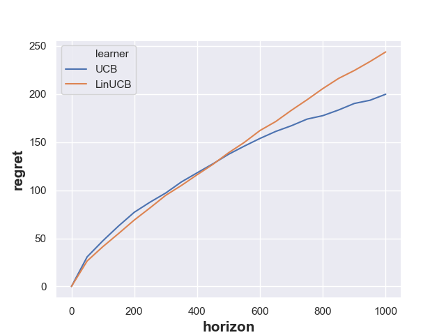
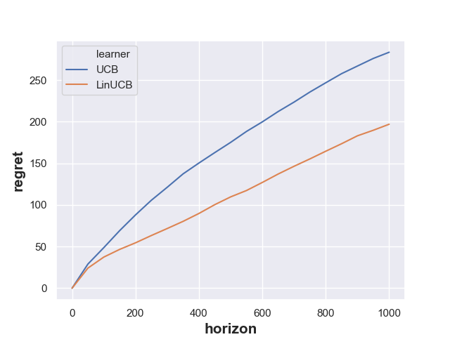
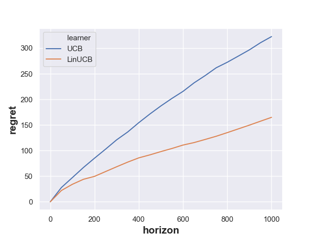

# Report of HW7

This is a short report of the HW7, which mainly discusses behaviors and performances of contextual bandit algorithms.
For all other details information please see the [README.md](README.md)

## Plots
Follow the recommendations of hyper-parameters in the handout, we have generate minimax regrets of the *UCB Algorithm*
and the *LinUCB Algorithm* shown in Figure 1 to Figure 3

Figure 1: When n = 10

Figure 1: When n = 30

Figure 1: When n = 50

## Discussions
From the plots above, we notice that when the dimension of arms is low (e.g., `n=10`), the *UCB Algorithm* seems out-perform
the *LinUCB Algorithm*, but when the dimension goes higher and higher, the advantage of the latter becomes more and more
prominent. The reason comes from the fact that:

+ Theoretically, the minimax regret of *UCB Algorithm* is bounded by `O(sqrt(n T ln(nT)))`, which has nothing to do with
the dimension but heavily related to the total number of arms in the bandit

+ Also, the counterpart of *LinUCB Algorithm* is bounded by `O(sqrt(d T ln(n) Polyln(T) ))`, which depends on both the dimension
and the total number of arms. However, if we analyze more carefully, the `ln(n)` terms can be neglected since it's not the
dominant term. Then, the asymptotic behavior becomes approximately independent from the total number of arms

+ When `n=10`, it can be regarded as a constant and have limited effect on the regret bound of the *UCB Algorithm*. At this time,
the poly-logarithmic term in the regret bound of the *LinUCB Algorithm* overwhelms the logarithmic term in the *UCB Algorithm*
, which makes it inferior.

+ When `n=30` and `n=50`, or even higher, it becomes an influential factor to the regret bound of the *UCB Algorithm*.
This term will finally overwhelm the poly=logarithmic term in the *LinUCB Algorithm*, making a reversal of two algorithms
